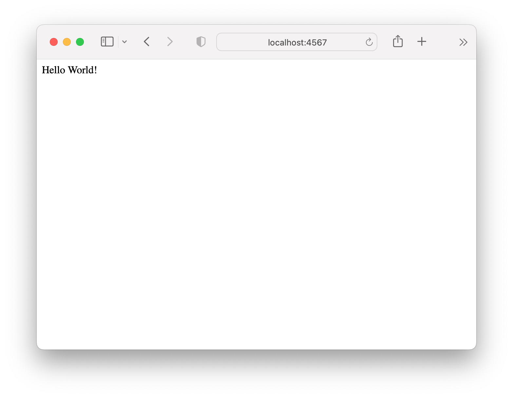
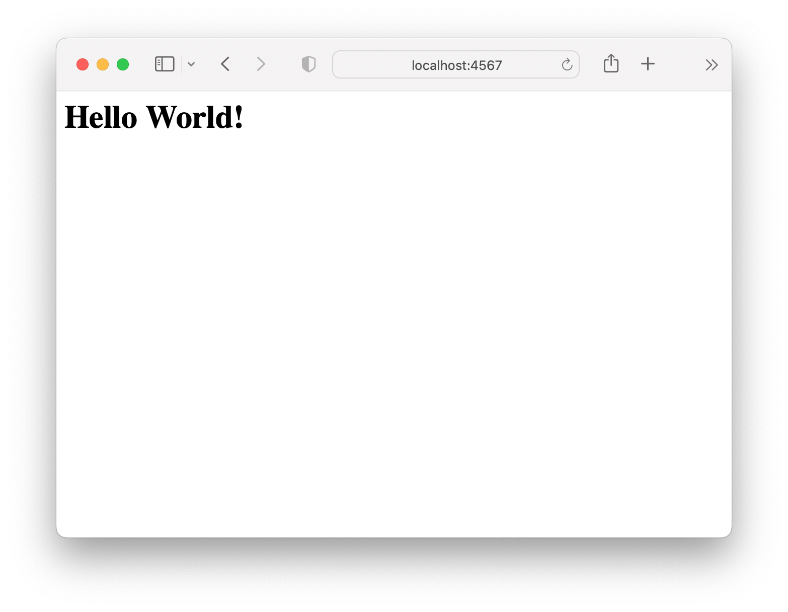
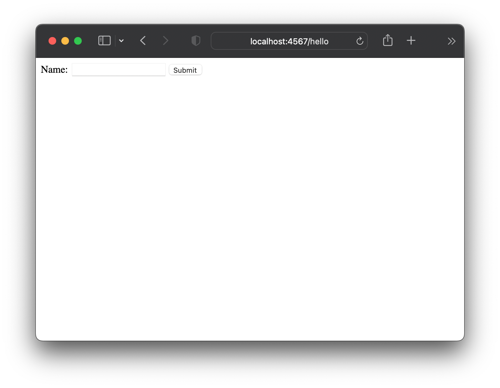

# Boffin Night: Webifying a Simple Java App

Starter code for building a simple Java web app

This document contains a super brief overview of a variety of web concepts. Web
development is a huge field, and this project is just going to show you enough
to get started. There are links throughout the document to sources with more
detailed information if you want to learn more.

## Background

This project is a simple Java application that uses the Gradle build system,
which is one of the most commonly used build systems for Java projects. Build
systems like Gradle are used to manage external dependencies and to build and
test applications. Running `javac *.java` works well enough for simple projects,
but not so much when your project has multiple directories, or uses external
libraries.

The project structure looks like:

```
boffin-java-webapp/
  app/               <-- source code, application resources
    src/
      main/
        java/        <-- app source code
        resources/   <-- app resources, like images
      test/          <-- unit tests
    build.gradle     <-- tells gradle how to build the app
  gradle/            <-- gradle executable files
  gradlew            <-- script for running gradle on Mac/Linux
  gradlew.bat        <-- script for running gradle on Windows
  settings.gradle
```

## Getting started

First, clone this repository to your local system. Once you have the project,
you have a couple of options for building and running git:

1. Use the `gradlew` or `gradlew.bat` scripts in the repository
2. Use the "Run" button in VS Code

Either should work, but the Gradle scripts will provide some conveniences while
working on the web app.

To build and run the app with Gradle, open a terminal / command prompt and cd
into the repository directory on your system. On Mac or Linux, run

```
> ./gradlew run
```

On Windows, run

```
> gradlew.bat run
```

You should see some activity in the terminal as Gradle builds the app, then some
output and a success message.

```
❯ ./gradlew run

> Task :app:run
Hello World!

BUILD SUCCESSFUL in 713ms
2 actionable tasks: 2 executed
```

You can make the output a bit less noisy by adding a `-q` option:

```
❯ ./gradlew run -q
Hello World!
```

If you run the app in VS Code, a terminal pane will open and show something
similar:

```
❯  /usr/bin/env /opt/homebrew/Cellar/openjdk/18.0.2.1_1/libexec/openjdk.jdk/Contents/Home/bin/java -XX:+ShowCodeDetailsInExceptionMessages @/var/folders/tx/66d9gy9s1mv5zx0fpx8symt8
0000gn/T/cp_daqyqo84eqa0genhx16sdn1v1.argfile boffin.App
Hello World!
```

## Adding your application code

Your application code will go in `app/src/main/java/boffin`. There's already an
App.java file in there; it just contains some starter code generated by Gradle.
You'll need to replace the code in the App class with your own code.

When updating the App class, you should keep the package and class name the
same, but you can replace all the code in `main`, and add additional methods to
the class. You can also add more files in `app/src/main/java/boffin`, just make
sure that all of them have a `package boffin;` declaration at the top of the
file.

Once you've updated the application code, try running the app again and check
that your code is working as expected.

## Web app primer

Web applications can be client-side or server-side, or some mix of the two. A
client-side app is usually written in JavaScript. A browser downloads the
application code from a server (even client-side apps need a server) and then
executes it. Browser-based games and interactive applications like music players
are often client-side apps.

Server-side apps can be written in many languages, including Java. The program
logic runs on the server, and the browser accesses different URLs to download
different pages that are rendered by the app. Most web apps, like Google's
search page or Amazon's storefront, are primarily server-side applications.

The code in a server-side app may look like the code for any other Java
application. A key difference is in how information gets into and out of the
app. In a standalone Java app, such as the ones you've written in class, the
console is often used for this purpose. In a web app there is no console (well,
not one that users generally see). The user must interact with the app using a
web browser, and the browser must be able to communicate with the web app over
the internet (or some smaller network) using the
[HTTP protocol](https://developer.mozilla.org/en-US/docs/Web/HTTP/Overview).

### HTTP

HTTP is the protocol that browsers use to talk to web servers. (There are other
protocols that computers might use to talk to each other over the network, but
HTTP is the one primarily used for the web.) A browser sends requests to a
server, and a server sends back responses. A request is made up of a URL,
headers (metadata), and a body (data). A response contains a status code,
headers, and may also contain a body.

HTTP defines several verbs or
[methods](https://developer.mozilla.org/en-US/docs/Web/HTTP/Methods) that
describe the general type of a request : GET, PUT, POST, DELETE, and OPTION are
some of the most commonly used. A GET request is used to get data, a POST
request is used to send (or "post") data to a server, a DELETE request usually
deletes some record on a server, etc. For example, when you type a URL into a
browser's address bar and hit enter, the browser browser makes a GET request to
that URL and then displays whatever it gets back. When the browser wants to send
data to a server, such as when a user submits a form, the browser may make
another GET request, or it could make a POST or PUT request.

In the end it's up to a server to decide how to handle a request. A server
_could_ be written to delete records with GET requests and serve pages for
DELETE requests, but that would be terribly confusing.

### URLs

A
[URL](https://developer.mozilla.org/en-US/docs/Learn/Common_questions/What_is_a_URL)
is string that identifies some resource on the web. Often this is a web page,
but it could also be some smaller piece of data served by a web app. For
example, `https://gradingapp.local/` might access the home page for a app to
manage student grades, and `https://gradingapp.local/student/123` might return a
page showing the grades for a particular student.

URLs can also be used to send data to a server as well as request it. This is
usually done using
[search parameters](https://developer.mozilla.org/en-US/docs/Learn/Common_questions/What_is_a_URL#parameters)
(also called "query parameters"). These are key/value pairs added to the end of
a URL after a question mark (?). They are often use for things like search
filters, and to send information to a server to help it complete a request. For
example, if you type "best tacos near me" into a Google search field, the search
page tells the browser to load
`https://www.google.com/search?q=best+tacos+near+me` (with a bunch of other
search parameters). The `q` search parameter tells Google what the user is
search for so it can serve a page of search results.

### HTML

Web pages are written in
[HTML](https://developer.mozilla.org/en-US/docs/Web/HTML), which lets them
include formatted text, images, scripts, and links to external resources. HTML
is a declarative language that uses "markup" to describe the structure of a
document. A very simple HTML document would be:

```html
<html>
	<body>
		<h1>Hello, world!</h1>
	</body>
</html>
```

The things between angle brackets are "tags" that represent "elements". For
example, the `<html>` tag says "this is an HTML document". The `<body>` tag
within it says "this is the visible content of the document". The `<h1>` tag
within that denotes a level 1 heading.

There are a lot of tags you can use to create documents, such as:

- `` is an image
- `<ul><li>dog</li><li>cat</li></ul>` is an unordered (bulletted) list with two
  items, 'dog' and 'cat'
- `<h2>` is a level 2 (smaller) heading
- `<a href="https://google.com">Google</a>` is a link with the text "Google"
  that, when clicked, will send the browser to https://google.com

Tags can have attributes -- that's the `href` in the `a` tag above. An attribute
is metadata attached to a tag. The `href` attribute is how the browser knows
that the `a` tag above should send the user to `https://google.com`.

### CSS

CSS is the language used to style the web. CSS lets you change fonts, colors,
and font sizes. It lets you position elements wherever you need to on a page,
change how they overlap, and even animate them.

Some commonly used CSS rules include:

- `font-size` to set the font size
- `color` to set the text color
- `background` to set the background color or image
- `width` to set the width of an element

The simplest and most direct way to use CSS is with "inline styles". This means
adding a `style` attribute containing some CSS rules to a tag. To make the text
in an `<h2>` red, we could add a `style` attribute to the heading:

```html
<h2 style="color:red">I'm red!</h2>
```

## Making a simple web app

There are a number of tools for making web applications with Java, from fairly
simple libraries like [Spark](https://sparkjava.com) to hugely complex
frameworks like [Spring](https://spring.io). For this project we're going to use
Spark.

### Using a web framework

To use Spark, we have to get the Spark JAR files onto our system and make sure
they get used when we build and run our app. We could go find the Spark JAR on
the internet and download it, along with whatever other libraries it depends on.
An easier solution is to tell the build system (Gradle) that we want to use
Spark, and let it handle the rest. We can do that by adding a couple lines to
the `dependencies` section in `app/build.gradle`:

```groovy
dependencies {
    // Use JUnit Jupiter for testing.
    testImplementation 'org.junit.jupiter:junit-jupiter:5.8.2'

    // This dependency is used by the application.
    implementation 'com.google.guava:guava:31.0.1-jre'
    // Added for Spark
    implementation 'com.sparkjava:spark-core:2.9.4'
    implementation 'org.slf4j:slf4j-simple:2.0.0'
}
```

The `org.sparkjava` dependency is Spark itself, and the `org.slf4j` one is an
optional logging library used by Spark. When we build the app, Gradle will
download those libraries and make them available to our app code.

### Hello world

Now it's time to make the simplest web server. Create a new file named
Server.java in `app/src/main/java/boffin`. In that file, import
`static spark.Spark.get;`; this is method we can use to create handlers for GET
requests. Add a `main` method, and in it use the `get` method to create a simple
handler:

```java
public static void main(String[] args) {
    get("/", (req, res) -> "Hello World!");
}
```

This handler will be run if a browser requests the root path ("/") from the
server. It may look a bit odd if you've never seen a Java
[lambda expression](https://www.w3schools.com/java/java_lambda.asp) before. A
lambda is basically a short block of code that can take parameters and that
returns some value. Here our lambda takes two parameters, req ("request") and
res ("response") and returns the string "Hello World!".

Notice that there aren't any explicit types in the lambda. Those are actually
part of the `get` method. Its function signature says that it takes 2
parameters: the first must be a string, and the second must be a function that
takes Request and Response parameters and returns an Object.

Before we can run the server, we need to update the project settings to say that
Server's main is the real main. Edit `app/build.gradle` and change the value of
`mainClass` to `boffin.Server`.

Now when you run your app, you should see some jetty-related messages in the
terminal where your app is running, and you may see an OS popup about allowing
Java to act as a server. When you create a request handler using one of Spark's
helpers, Spark will automatically start a web server thread when you run your
app.

```
[Thread-0] INFO org.eclipse.jetty.util.log - Logging initialized @69ms to org.eclipse.jetty.util.log.Slf4jLog
[Thread-0] INFO spark.embeddedserver.jetty.EmbeddedJettyServer - == Spark has ignited ...
[Thread-0] INFO spark.embeddedserver.jetty.EmbeddedJettyServer - >> Listening on 0.0.0.0:4567
[Thread-0] INFO org.eclipse.jetty.server.Server - jetty-9.4.48.v20220622; built: 2022-06-21T20:42:25.880Z; git: 6b67c5719d1f4371b33655ff2d047d24e171e49a; jvm 18.0.2.1+1
[Thread-0] INFO org.eclipse.jetty.server.session - DefaultSessionIdManager workerName=node0
[Thread-0] INFO org.eclipse.jetty.server.session - No SessionScavenger set, using defaults
[Thread-0] INFO org.eclipse.jetty.server.session - node0 Scavenging every 660000ms
[Thread-0] INFO org.eclipse.jetty.server.AbstractConnector - Started ServerConnector@1b02b12f{HTTP/1.1, (http/1.1)}{0.0.0.0:4567}
[Thread-0] INFO org.eclipse.jetty.server.Server - Started @136ms
```

One of the messages will tell what address and port your application is serving
on; it may look like `(http/1.1)}{0.0.0.0:4567}`. The 0.0.0.0 means the app is
listening on all the network connections your machine has. The `:4567` is the
"port" the application is serving on. (If a URL doesn't include a port the
browser will assume port 80, but it's common for servers to use other ports
during development.) You should be able to visit your app by browsing to
http://localhost:4567, or possibly http://127.0.0.1:4567 (127.0.0.1 and
"localhost" both mean "this computer"). When you do, you should see the text
"Hello World!" in the upper left of the page. Success!



The server will run continuously until you stop the app using CTRL+C or the
"Stop" button in VS Code (depending on how you started the app).

### Serving HTML

Sending strings is great, but the web usually looks a bit more interesting. All
the formatting, images, and colors come from HTML and CSS, so it would be nice
to be able to use that instead of just plain strings.

One way to send HTML from our server is simply create a string of HTML code and
send it. Try this: in your Server.java, change the `"Hello World!"` string to be
`"<html><body><h1>Hello World!</h1></body></html>"`. You'll need to stop and
restart your server for the change to take effect.

When you load the page now, you should see a larger, bolder message.



### Sending data

Now we have a server that can receive requests and send responses. Let's send it
some data! Specifically, let's add a new request handler for `/hello` that we
can send our name to.

In Server.java, add a new `get` handler:

```java
get("/hello", (req, res) -> {
    return "<html><body><h1>Hello World!</h1></body></html>";
});
```

Rather than saying "Hello World!", we actually want it to say something like
"Hello Jason!". To do that, we'll send it the name as a search parameter (we'll
call it "name"), and our handler will use that. Sending a search parameter is
easy -- just add it to the URL: `http://localhost:4567/hello?name=Jason`.

To actually use the search parameter in the handler, Spark provides a
`queryParams` method on the request object. Using that value, we can serve a
more meaningful string:

```java
get("/hello", (req, res) -> {
    String name = req.queryParams("name");
    return "<html><body><h1>Hello " + name + "!</h1></body></html>";
});
```

### Forms

Manually entering a URL is one way to use a web app, but it's not very
user-friendly. Usually you'd have some sort of input field for the user to type
into. That's where
[forms](https://developer.mozilla.org/en-US/docs/Web/HTML/Element/form#examples)
come in.

A simple form that works with our `/hello` endpoint would look like:

```html
<form method="get">
    <label>Name: <input name="name">
    <button>Submit</button>
</form>
```

Now we need to decide what to serve the user: the form or the message. One
option would be to serve the form on the root path (`/`), and then have the form
send the user to the `/hello` path with the name parameter. A more flexible
option would be to have the `/hello` handler show the form if no name was
passed, or the message if a name was passed.

Our handler in that case would look like:

```Java
get("/hello", (req, res) -> {
    String name = req.queryParams("name");
    if (name == null) {
        return "<html><body><form method='get'><label>Name: <input name='name'></label><button>Submit</button><body></html>";
    }
    return "<html><body><h1>Hello " + name + "!</h1></body></html>";
});
```

Now we get a form when visiting `/hello`:



Enter your name and click the "Submit" button, and you should see the greeting
with the name you entered. Note the URL in the browser -- it now has a search
string, like `http://localhost:4567/hello?name=Jason`. When you use a form with
the `get` method, the browser will gather up all the fields in the form and turn
them into a search string, where the `name` attribute of each form input is the
name of a search parameter, and the value of the input is the parameter value.

### Templates

Creating and sending HTML strings can quickly get messy, and that's before we've
even started adding styles. Luckily, there are ways to keep all that HTML out of
our server code, like templates.

An HTML template is a file containing code that is mostly HTML, but with
placeholders and other directives that let the HTML be modified based on data
from the server. A request handler in the server will load the template and
"render" it using request data, then return the rendered string to the browser.

There are many templating languages. One of the simpler ones is
[mustache](http://mustache.github.io). Spark comes with built-in support for
using Mustache templates, so we'll use that one.

A mustache template goes in a `.mustache` file. Create a `templates/` directory
under `app/src/main/resources` and add a file named `hello.mustache` in there
with our original greeting HTML:

```mustache
<html>
    <body>
        <h1>Hello World!</h1>
    </body>
</html>
```

Comment out the code in the `/hello` handler, and add:

```java
get("/hello", (req, res) -> {
    HashMap<String, Object> model = new HashMap<>();
    return new MustacheTemplateEngine().render(
        new ModelAndView(model, "index.mustache"));
});
```

You'll also need to add a new dependency to `app/build.gradle` and import a
couple things in `Server.java`.

```groovy
// build.gradle
dependencies {
    // ...
    implementation 'com.sparkjava:spark-template-mustache:2.7.1'
}
```

```java
// Server.java
import java.util.HashMap;
import spark.ModelAndView;
import spark.template.mustache.MustacheTemplateEngine;
```

Restart the app and visit `/hello` and you should see the "Hello World!" heading
again.

This may seem like a lot of stuff to do when we could already render HTML using
simple strings. However, templates make it much easier to create complex web
pages, and they make the logic in the handler function much easier to follow.
Debugging a 2 line handler function is much easier when you don't have to scroll
through tens or hundreds of lines of HTML strings.

One of the neat things about templates are directives that let you change what
gets rendered based on the data available when you're doing the rendering. We
can replicate the conditional rendering we did earlier in the `/hello` handler
by passing some data to the template and using mustache "sections" to control
what's rendered.

A section is denote with tags, just like HTML, but they're not HTML tags. A
standard section looks like `{{#name}}some stuff{{/name}}`. When the mustache
template is rendered, if it was passed a data property named "name", it will
render "some stuff". If it wasn't passed a "name" property, or if name was null,
nothing will be rendered.

```mustache
<html>
    <body>
        {{^name}}
        <form method="get">
            <label>Name: <input name="name"></label>
            <button>Submit</button>
        </form>
        {{/name}}
        {{#name}}
        <h1>Hello {{name}}!</h1>
        {{/name}}
    </body>
</html>
```

We pass data by setting properties on the `model` HashMap that gets passed to
the `render` function. Try adding a `name` property to `model`, then restart
your app and browse to `/hello`. You should get a Hello message when the name
value you used.

If we use the "name" search parameter as the value of the "name" property on
`model`, we should have our web app functioning again.

## Makeing your own web app

Now that we have all the basics in place, we can make a web app out of your own
command line application. How that's going to work depends on what your app
looks like. Assuming your app was the BMI calculator from 1180, it might look
like:

```java
// App.java
package boffin;
import java.util.Scanner;

class App {
    public static void main(String[] args) {
        final double IMPERIAL_CONV = 703.0;

        Scanner bob = new Scanner(System.in);

        System.out.print("Enter your height in inches: ");
        int height = bob.nextInt();

        System.out.print("Enter your weight to the nearest pound: ");
        int weight = bob.nextInt();

        double bmi = (weight * IMPERIAL_CONV) / Math.pow(height, 2);
        System.out.printf("Your BMI is %.1f\n", bmi);
    }
}
```

For this to work as a web app, we'll need code that we can use from our Server
class. A good first step is to move calculating part of the code to a method in
the App class.

```java
// App.java
package boffin;
import java.util.Scanner;

class App {
    public static void calculateBmi(int height, int weight) {
        final double IMPERIAL_CONV = 703.0;
        double bmi = (weight * IMPERIAL_CONV) / Math.pow(height, 2);
        System.out.printf("Your BMI is %.1f\n", bmi);
    }

    public static void main(String[] args) {
        Scanner bob = new Scanner(System.in);

        System.out.print("Enter your height in inches: ");
        int height = bob.nextInt();

        System.out.print("Enter your weight to the nearest pound: ");
        int weight = bob.nextInt();

        calculateBmi(height, weight);
    }
}
```

We also don't need the calculating function to be printing to System.out, so we
can have it return the answer instead of displaying it.

```java
// App.java
package boffin;
import java.util.Scanner;

class App {
    public static double calculateBmi(int height, int weight) {
        final double IMPERIAL_CONV = 703.0;
        double bmi = (weight * IMPERIAL_CONV) / Math.pow(height, 2);
        return bmi;
    }

    public static void main(String[] args) {
        Scanner bob = new Scanner(System.in);

        System.out.print("Enter your height in inches: ");
        int height = bob.nextInt();

        System.out.print("Enter your weight to the nearest pound: ");
        int weight = bob.nextInt();

        double bmi = calculateBmi(height, weight);
        System.out.printf("Your BMI is %.1f\n", bmi);
    }
}
```

Now we have a method we can use in Server! Add a new `/bmi` handler that will
look for "height" and "weight" search parameters. It will need to convert them
to ints (search parameter values are always strings) and then

```java
// Server.java
get("/bmi", (req, res) -> {
    String heightStr = req.queryParams("height");
    String weightStr = req.queryParams("weight");
    HashMap<String, Object> model = new HashMap<>();

    int height = Integer.parseInt(heightString);
    int weight = Integer.parseInt(weightString);
    double bmi = App.calculateBmi(height, weight);
    model.put("bmi", bmi);

    return new MustacheTemplateEngine().render(
            new ModelAndView(model, "bmi.mustache"));
});
```

You'll also want a new template that renders a BMI form and message rather than
our old "name" form and "Hello" message.

If you restart your server and browse to `/bmi`, you'll get an error. That's
because our handler isn't very smart yet -- it's assuming that "height" and
"weight" parameters will always existing, and it tries to convert them to ints.
If you didn't provide parameter values, bad things happen. So, handling that
case where either or both of the search paramters isn't defined, or is an
invalid value, should be the first order of business.
